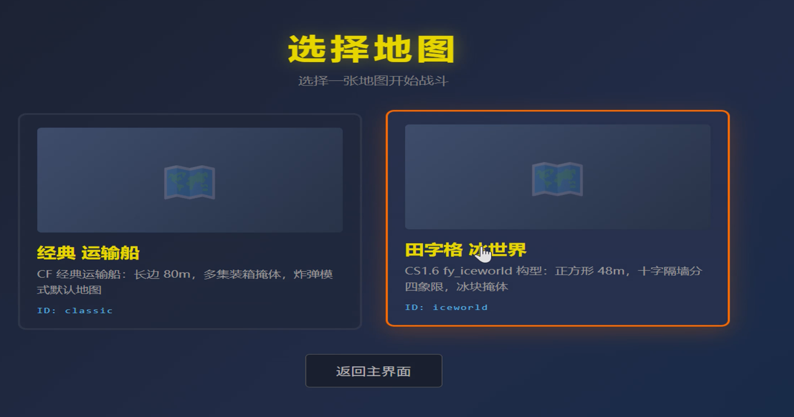
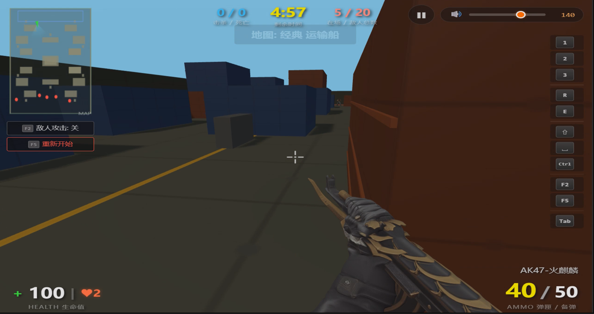
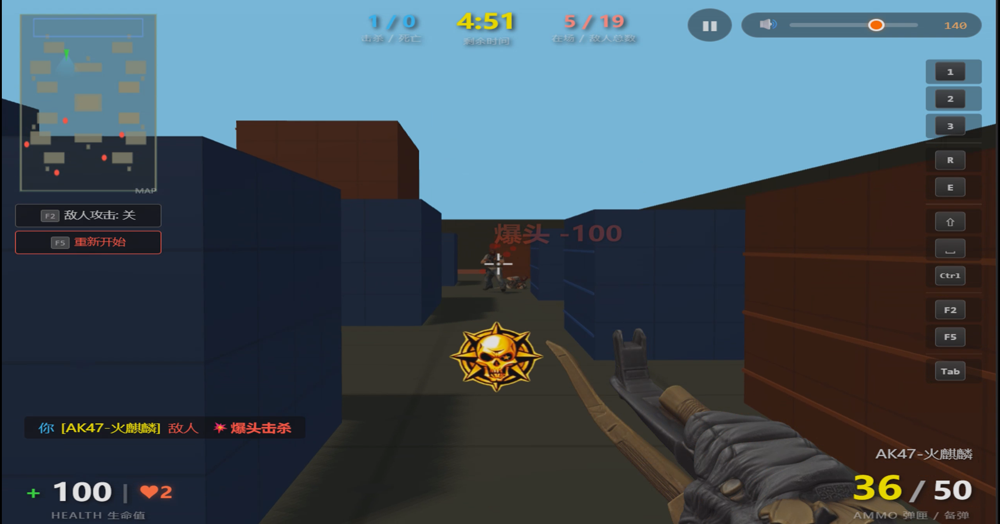
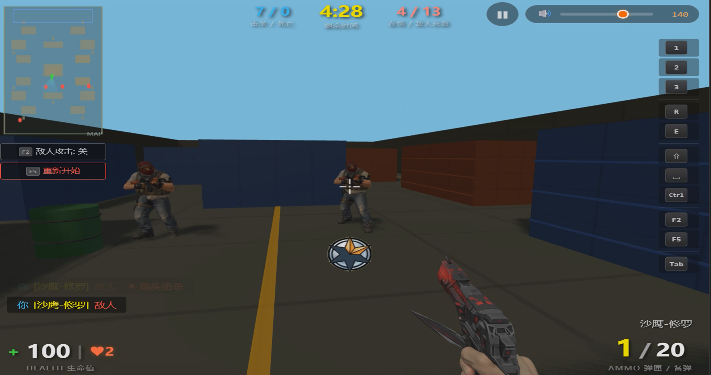
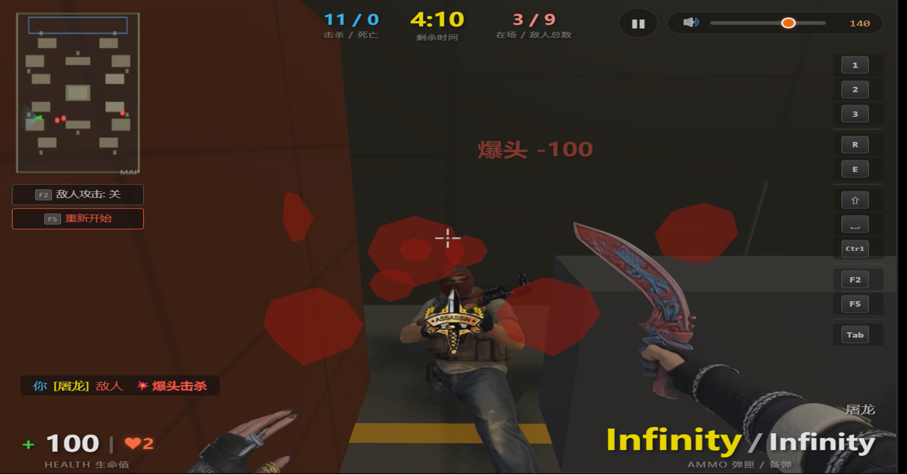
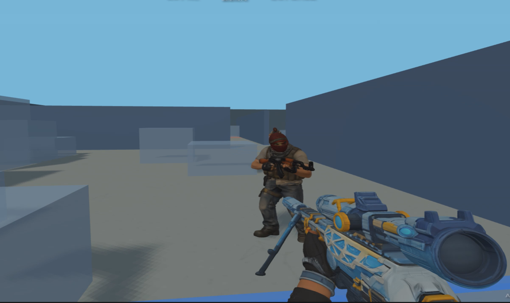
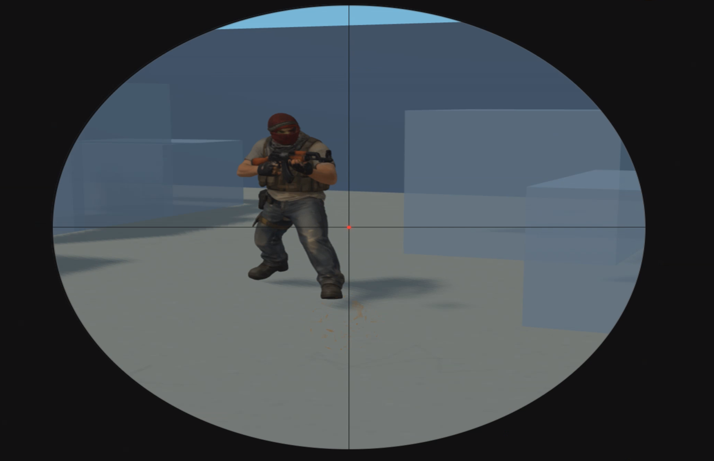

# CF-FPS 穿越火线风格第一人称射击游戏

一款基于 **Three.js** 与 **cannon-es** 构建的纯前端 3D FPS 游戏，灵感来源于经典 FPS《穿越火线》（CF）。

项目全部用原生 JavaScript（ES Modules）编写，不依赖 React/Vue 等框架，聚焦于"第一人称战斗体验"本身——武器手感、开镜放大、爆头反馈、C4 炸弹模式、CF 风格 HUD 等核心玩法。

> 🎮 直接在浏览器中运行，无需服务端。
<div align="center">













</div>
---

## 📖 目录

- [特性](#-特性)
- [技术栈](#-技术栈)
- [项目结构](#-项目结构)
- [快速开始](#-快速开始)
- [操作与玩法](#-操作与玩法)
- [核心系统说明](#-核心系统说明)
- [资源目录](#-资源目录)
- [构建与部署](#-构建与部署)
- [开发建议](#-开发建议)
- [License](#-license)

---

## ✨ 特性

- **第一人称视角**：Pointer Lock + WASD 移动 + 鼠标视角
- **CF 风格三神器**：AK47-火麒麟（步枪）/ 沙鹰-修罗（手枪）/ 麒麟刺（匕首）
- **绿幕贴图武器**：使用 `THREE.ShaderMaterial` 自定义 GLSL 着色器，武器贴图支持绿幕抠图
- **右键开镜（ADS）**：FOV 平滑插值 + 武器位置/缩放插值（腰射 ↔ 开镜）
- **敌人 AI**：战术据枪瞄准姿势 + 行走动画 + 路径寻找 + 可开关攻击
- **C4 炸弹模式**：安放 / 拆除 / 倒计时 + 爆炸白屏闪光 + 镜头震动
- **击杀反馈**：CF 连杀语音播报（2kill ~ 8kill）+ 绿幕抠图击杀视频
- **爆头机制**：独立音效 + 红色大字体 + 专属视频
- **音效全链路**：BGM / 脚步 / 换弹 / 射击 / 爆炸，Howler.js + WebAudio
- **总音量滑块**：持久化 `localStorage`，范围 0 ~ 200%
- **HUD & UI**：小地图 / 计分板 / 击杀播报 / 伤害数字 / 受伤红框 / 换弹进度条 / 拆包进度条
- **CF 风格**：神器命名、UI 配色、击杀播报风格均贴近原版 CF

---

## 🛠 技术栈

| 层        | 技术                          | 说明                                |
|-----------|-------------------------------|-------------------------------------|
| 渲染      | `three.js` ^0.160             | WebGLRenderer / PerspectiveCamera / 阴影 |
| 物理      | `cannon-es` ^0.20             | 角色刚体 / 射线检测 / 碰撞判定      |
| 音频      | `howler` ^2.2                 | 多实例混音 / Sprite / 3D 空间音效   |
| 构建      | `vite` ^5.0                   | HMR 热更新 / ES Modules             |
| 语言      | 原生 ES2022 Modules           | 无 TypeScript / 无框架              |
| 着色器    | GLSL                          | 绿幕抠图（ChromaKeyMaterial）       |

---

## 📁 项目结构

```
FpsGame/
├── index.html                 # 入口页面 + CF 风格 HUD + 全部 CSS
├── package.json
├── vite.config.js             # Vite 构建配置
├── public/                    # 静态资源（Vite 直接拷贝）
│   ├── images/                # 绿幕武器贴图：Huo1.png / XIU2.jpg / Ni3.png
│   ├── sounds/                # BGM、脚步声、换弹、CF 连杀语音
│   └── video/                 # 绿幕击杀视频（cf_1kill ~ cf_8kill / headshot / kinfe）
└── src/
    ├── main.js                # 启动入口：开始画面、音量滑块、Pointer Lock
    ├── core/
    │   ├── Game.js            # 游戏主循环、HUD、回合、重置
    │   ├── SceneManager.js    # Three.js 场景 / 相机 / 灯光 / 渲染器
    │   ├── Physics.js         # cannon-es 世界、射线检测、角色刚体
    │   ├── Input.js           # 键盘 / 鼠标 / 鼠标滚轮
    │   ├── AudioFx.js         # Howler 音效封装（BGM / 射击 / 换弹 / 击杀）
    │   ├── Constants.js       # 武器配置、回合参数、物理常量
    │   └── EventBus.js        # 全局事件总线
    ├── player/
    │   ├── PlayerController.js# 第一人称控制：移动 / 跳跃 / 冲刺 / 下蹲
    │   └── Health.js          # 生命值与受伤处理
    ├── weapons/
    │   ├── Weapon.js          # 武器基类
    │   ├── WeaponManager.js   # 切枪 / 开镜插值 / 武器晚动
    │   └── arsenal/
    │       ├── Rifle.js       # AK47-火麒麟（绿幕贴图平面）
    │       ├── Pistol.js      # 沙鹰-修罗（绿幕贴图平面）
    │       └── Knife.js       # 麒麟刺（绿幕贴图平面 + 挥砍动画）
    ├── enemies/
    │   ├── Enemy.js           # 单个敌人：建模 / 战术据枪姿势 / 行走动画
    │   ├── EnemyManager.js    # 敌人生成、更新、死亡管理
    │   └── Pathfinder.js      # 简易寻路
    ├── modes/
    │   └── BombManager.js     # C4 安放 / 拆除 / 爆炸
    ├── effects/
    │   ├── MuzzleFlash.js     # 枪口闪光
    │   ├── BulletTracer.js    # 子弹轨迹
    │   ├── BloodSplatter.js   # 血液飞溅
    │   └── ParticleManager.js # 粒子系统
    ├── map/
    │   ├── MapLoader.js       # 地图加载
    │   └── Map_Transport.js   # 运输船地图
    ├── ui/
    │   └── KillVideo.js       # 绿幕击杀视频播放（透明抠图）
    └── utils/
        ├── ChromaKeyMaterial.js # 绿幕抠图 ShaderMaterial
        └── TextureGen.js        # 程序化纹理生成
```

---

## 🚀 快速开始

### 前置要求

- Node.js >= 16（推荐 18+）
- npm >= 8

### 安装与启动

```bash
# 1. 克隆仓库
git clone <repo-url>
cd FpsGame

# 2. 安装依赖
npm install

# 3. 启动开发服务器（默认 http://localhost:5173）
npm run dev
```

### 构建生产版本

```bash
npm run build    # 输出到 dist/
npm run preview  # 本地预览构建产物
```

> ⚠️ 注意：`public/sounds/`、`public/video/` 中包含大体积音频/视频文件，建议使用 Git LFS 管理。

---

## 🎮 操作与玩法

| 操作            | 按键         | 说明                            |
|-----------------|--------------|---------------------------------|
| 移动            | `W / A / S / D` | 前后左右                        |
| 视角            | 鼠标         | Pointer Lock                    |
| 射击            | 鼠标左键     | 长按步枪自动连射                |
| 开镜（ADS）     | 鼠标右键     | 长按开镜 / 短按点击锁定切换     |
| 跳跃            | `Space`      |                                 |
| 冲刺            | `Shift`      |                                 |
| 下蹲            | `Ctrl`       |                                 |
| 切换主武器      | `1`          | AK47-火麒麟                     |
| 切换副武器      | `2`          | 沙鹰-修罗                       |
| 切换近战        | `3`          | 麒麟刺                          |
| 换弹            | `R`          | 显示换弹进度条                  |
| 拆除炸弹        | `E`          | 靠近 C4 按住                    |
| 计分板          | `Tab`        | 长按显示                        |
| 开关敌人攻击    | `F2`         | 默认关闭（安全模式）            |
| 重新开始        | `F5`         | 重置弹药 / 血量 / 炸弹 / 敌人   |

### 游戏模式

- **默认模式**：击杀所有敌人获胜（击杀 / 死亡 / 在场敌人数 HUD 显示）
- **C4 炸弹模式**：敌人安放 C4 → 倒计时 15s → 玩家需击杀或拆除
  - 成功拆除或全部歼灭 → 胜利
  - C4 爆炸或玩家死亡 → 失败（爆炸瞬间白屏 + 镜头震动）

---

## 🔍 核心系统说明

### 1. 绿幕武器贴图（`ChromaKeyMaterial`）

武器模型不是传统 3D mesh，而是 **`PlaneGeometry` + 绿幕贴图**。

`src/utils/ChromaKeyMaterial.js` 提供 `createChromaKeyMaterial(url, options)`：

```glsl
// fragment shader 核心
float greenDiff = color.g - max(color.r, color.b);
if (greenDiff > threshold) discard;
color.g = min(color.g, max(color.r, color.b) + spillReduction);
```

效果：绿幕被自动透明化，武器前景保留，且保留原图的发光/高光效果。

### 2. 开镜插值系统（ADS）

`WeaponManager.update(dt)` 每帧驱动：

- `aimT`：0（腰射）↔ 1（完全开镜），以 `dt * 14` 平滑插值
- 位置：`hipPos` ↔ `adsPos`
- 缩放：`scale 1` ↔ `adsScale`（手枪 0.6 / 步枪 0.85）
- FOV：`baseFov 75` ↔ `weapon.config.adsFov`（手枪 45 / 步枪 38）

切枪时**重置 mesh.scale = 1**，避免开镜残留缩放导致切换后"闪一下特别大"。

### 3. 敌人战术 AI

敌人采用"等腰三角形据枪"姿势（双肘外撑、手枪前推），支持：

- 路径寻找 / 巡逻 / 追击 / 射击
- F2 开关控制是否攻击（默认关，方便演示）
- 爆头双倍伤害 + 爆头视频 + 爆头音效

### 4. 击杀反馈

`KillVideo.js` 在画面中央上方叠加一个 `<canvas>` 播放绿幕抠图视频：

- 1kill ~ 8kill：播放对应连杀视频 + CF 连杀语音
- 爆头：专属 `cf_headshot.mp4` + `headshot.wav`
- 刀杀：`cf_kinfe.mp4`

视频绿幕部分通过 2D Canvas 像素级抠图实现透明。

### 5. 音效系统（`AudioFx`）

- Howler.js 封装，支持主音量控制 `setMasterVolume(0 ~ 2)`
- 所有音效按事件命名：`shoot` / `reload` / `step` / `bomb` / `headshot` / `kill_N`
- 总音量滑块 `0 ~ 200%`，自动保存到 `localStorage.fps_master_volume`

---

## 📦 资源目录

| 路径                  | 说明                                                   |
|-----------------------|--------------------------------------------------------|
| `public/images/`      | 武器绿幕贴图：`Huo1.png` (AK) / `XIU2.jpg` (手枪) / `Ni3.png` (刀) |
| `public/sounds/`      | `bgm1.mp3`、`bgm2.mp3`、`reload.mp3`、`bomb.flac`、`cf_*.wav` 等 |
| `public/video/`       | `cf_1kill.mp4` ~ `cf_8kill.mp4`、`cf_headshot.mp4`、`cf_kinfe.mp4` |

---

## 🌐 构建与部署

```bash
npm run build
# 产物输出到 dist/，可部署到任意静态托管：
# - Vercel
# - Netlify
# - GitHub Pages
# - Nginx / 腾讯云 COS / 阿里云 OSS
```

部署后访问路径即可运行。建议配置 CDN + gzip 以加速大体积音频/视频传输。

---

## 💡 开发建议

- 武器贴图：直接替换 `public/images/` 下的绿幕图片即可，无需改代码
- 新增武器：在 `src/weapons/arsenal/` 加新类，继承 `Weapon`，在 `WeaponManager.init` 注册
- 调整开镜手感：修改 `Constants.js` 的 `adsFov` / `adsPos` / `adsScale`
- 调整射击参数：`Constants.js` 的 `damage` / `fireRate` / `recoil` / `magSize` 等
- 新增敌人类型：参考 `src/enemies/` 下 `Enemy.js` 与 `EnemyManager.js`

---

## 📄 License

MIT

---

<p align="center">
  <i>Made with Three.js · cannon-es · Howler.js · Vite</i>
</p>
